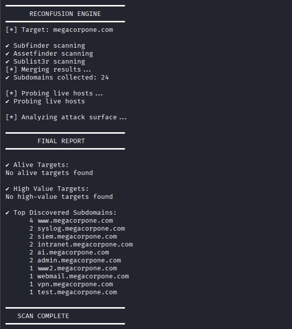

# ReconFusion

ReconFusion is a lightweight Bash-based reconnaissance tool designed to automate subdomain discovery, live host detection, and high-value target identification.

## 🔥 Features
- Multi-source subdomain enumeration
- Live host detection using HTTP validation
- High-value endpoint filtering
- Frequency-based target correlation
- Clean CLI interface with smooth output


<div align="center">
  <h3>Bash Scripts Demo</h3>
  
</div>


## 🚀 Usage

```bash
./reconfusion.sh example.com

## 🧠 What I Learned


- Bash scripting automation
- Recon workflow design
- Data parsing and filtering
- CLI tool development
